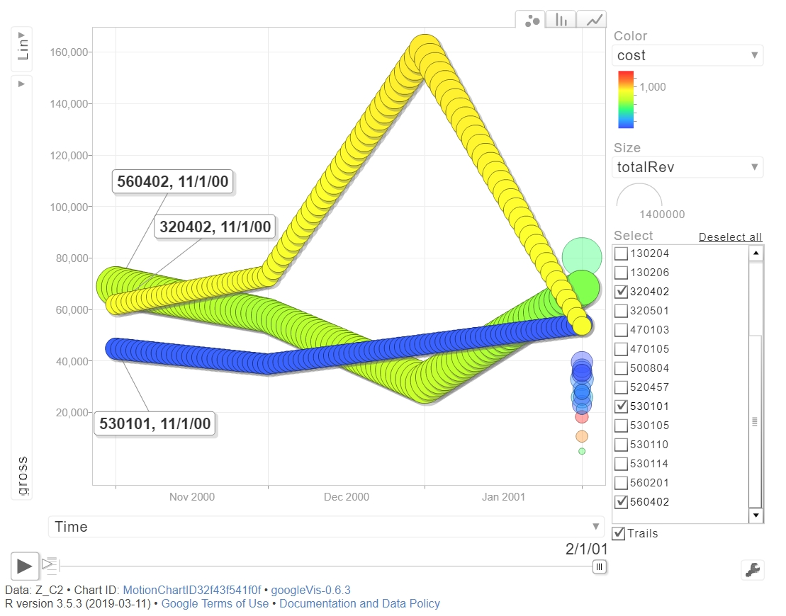
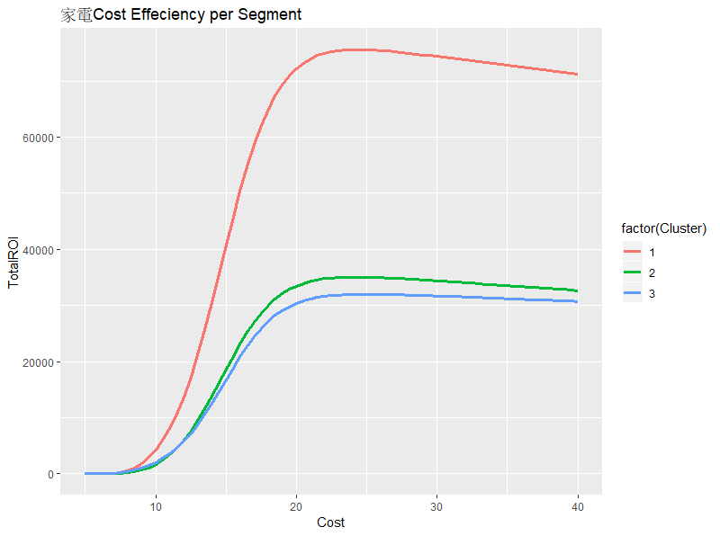
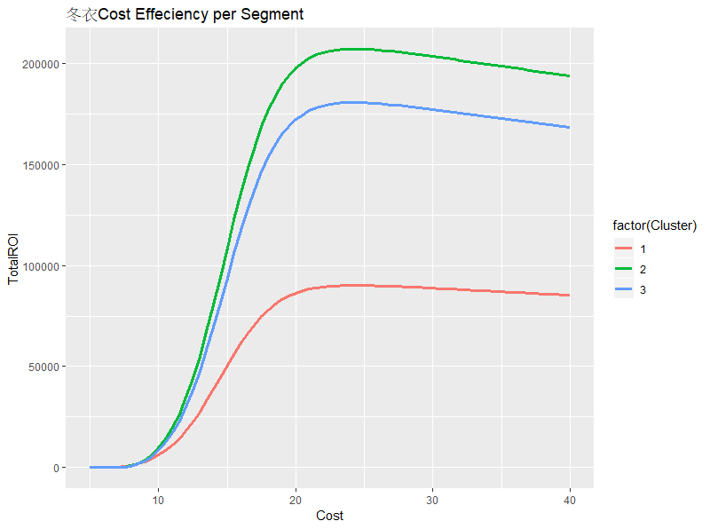
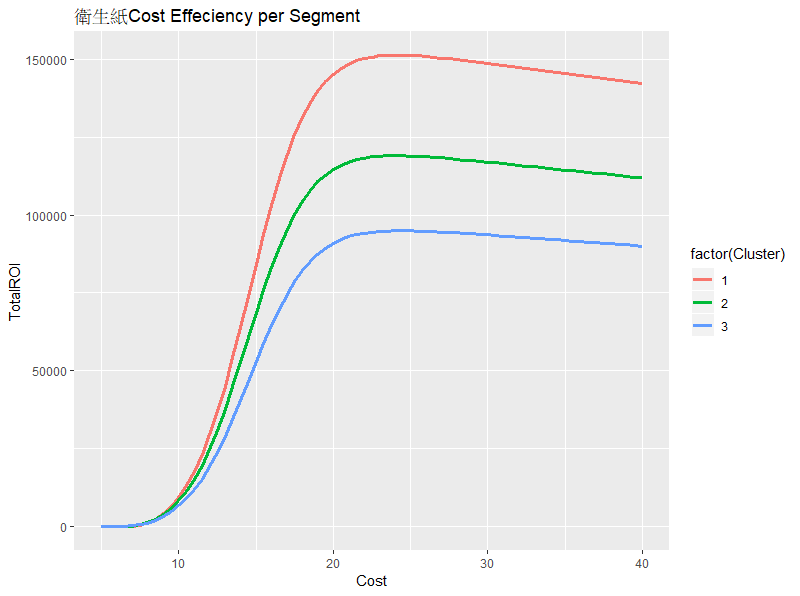

組員：`B044030015 許效軒`  `B046060036 王文弘`  `B054012011 黃冠綾`  `B046060027 姚詠馨`  `B046060035 張文瑜`  `M074020024 楊長舜`  

本組從kaggle上抓取2000年11月至2001年2月大峰百貨的銷售與交易資料，希望能了解該百貨的現況，分析顧客價值，並予以行銷策略，以最有效率的方式，提升未來期望報酬。  

**目錄**  

+  壹、現況總覽  
+  貳、重要品類分析  
+  參、整體與品類分群  
+  肆、行銷策略發想  
+  伍、模型與成本效益預測  
+  陸、總結


### 讀入套件


```{r setup, include=FALSE}
knitr::opts_chunk$set(echo = TRUE)

```

```{r echo=T, message=F, cache=F, warning=F}
rm(list=ls(all=T))
Sys.setlocale("LC_TIME","C")
pacman::p_load(magrittr, readr, caTools, ggplot2, dplyr,MASS, dendextend, vegan, randomcoloR, googleVis,knitr,kableExtra,rmdformats,tidyr)
options(knitr.table.format = "html")
```


# 壹、現況總覽  

## 1.1 讀進資料
```{r}
Z = read_csv("ta_feng_all_months_merged.csv") %>% data.frame %>% 
  setNames(c("date","cust","age","area","cat","prod","qty","cost","price"))
nrow(Z)
```

#### 資料格式轉換
```{r}
Z$date = as.Date(Z$date, format="%m/%d/%Y")
Z$age[is.na(Z$age)] = "na"
Z$age = factor(Z$age, levels=c(
  "<25","25-29","30-34","35-39","40-44","45-49","50-54","55-59","60-64",">65","na"), labels=c(
  "a20","a25","a30","a35","a40","a45","a50","a55","a60","a65","na"
  )) %>% as.character
Z$area = paste0("z",Z$area)
summary(Z)
```

#### 處理離群值
```{r}
# Quantile of Variables
sapply(Z[,7:9], quantile, prob=c(.99, .999, .9995))

# Remove Outliers
Z = subset(Z, qty<=24 & cost<=3800 & price<=4000) 
nrow(Z)
```

#### 彙總
```{r}
Z$tid = group_indices(Z, date, cust)
```

## 1.2各月分訂單數
```{r}
par(cex=0.8)
hist(Z$date,"months",las=2,freq=T,xlab="",main ="各月份訂單數",col ="#B1E4E3")
```

## 1.3顧客資訊摘要  
共有32256位顧客。
```{r}
n_distinct(Z$cust)  
```

### 1.3.1各年齡族群購買總數分布  
35-39歲顧客總購買數量最高。
```{r}
tapply(Z$qty, Z$age, sum) %>% sort()

ggplot(Z, aes(x =age, y = qty) )+ 
  geom_bar(stat = "identity")+
  theme(axis.text.x = element_text(angle = -70))
```

### 1.3.2各年齡族群花費總金額分布  
35-39歲顧客總購買數量最高且總花費金額也最高。
```{r}
tapply(Z$price, Z$age, sum) %>% sort()

ggplot(Z, aes(x = age, y =price) )+ 
  geom_bar(stat = "identity")+
  theme(axis.text.x = element_text(angle = -70))

```


### 1.3.3各年齡層客戶偏好消費時間  
客戶們都傾向在假日來商場購物，尤其是30到40歲這群人最為明顯。
```{r}
# 換成比例可以真正看出各年齡人數不同的問題，當數量不一致不能比較時換成比率是較好的方法。
library(d3heatmap)
table(Z$age,format(Z$date,"%u")) %>%
  {./rowSums(.)} %>%
  as.data.frame.matrix %>%
  d3heatmap(F,F,col="Greens")

```

### 1.3.3各區域客戶偏好消費時間  
住在松山區、大安區、信義區、內湖區明顯傾向在週日購物，推估是因為地緣位置相對其他區域（南港區、汐止區）比較遠，所以假日來購物會比較有充裕時間。
```{r}
table(Z$area, format(Z$date,"%u"))  %>%
  {./rowSums(.)} %>%
  as.data.frame.matrix %>%
  d3heatmap(F,F,col="Greens")

```


## 1.4顧客消費資料變數分布
```{r}
A = Z %>% 
  mutate(days = as.integer(as.Date("2001-03-01") - as.Date(date))) %>% 
  group_by(cust) %>% summarise(
    recent = min(days),     # 最近購買距今天數 
    freq = n(),             # 購買次數
    money = mean(price),   # 平均購買金額
    senior = max(days),     # 第一次購買距今天數
    since = min(date) # 第一次購買日期
  ) %>% data.frame

```

### 1.4.1 變數摘要
```{r}
summary(A)
```


### 1.4.2 變數分布檢視  
+  recency：為右偏分配，多數顧客在近20日內購物皆有購物。  
+  frequency：約一半的顧客購買次數為25次以內，平均值為25.3次，但多次頻繁購物(超過100次)之客戶也大有人在，其中購物次數最多之客戶在5個月內購買了1246次。  
+  seniority：多數顧客第一次購物在80-120天的區間，回推回去，大約就是在2000年11跟12月期間吸收了許多客人，近期吸收的客戶反而比較少。  
+  log(money)銷售金額多集中在exp(5)處約150元。
```{r}
p0 = par(cex=0.8, mfrow=c(2,2), mar=c(3,3,4,2))
hist(A$recent,25,main="recency",ylab="",xlab="")
hist(pmin(A$freq, 100),0:100,main="frequency",ylab="",xlab="")
hist(A$senior,20,main="seniority",ylab="",xlab="")
hist(log(A$money),main="log(money)",ylab="",xlab="") 
```

## 1.5 品類動態趨勢圖  

```{r}
# 對品類做彙總
Z= Z %>% mutate(avgprice = price/qty)

category = filter(Z, !is.na(cat)) %>% 
  group_by(cat) %>% summarise(
    itemsSold = sum(qty),
    totalRev = sum(price),
    avgPrice = sum(price)/sum(qty),
    gross = sum(price - cost),
    cost = mean(cost),
    noProduct = n_distinct(prod),
    nobuyer = n_distinct(cust)
  ) %>% arrange(desc(gross))
# 篩選總利潤最大的20個品類
top20 = category$cat[1:20]
category[1:20,]
```

#### 與時間軸彙整
```{r}
# 對品類(`category`)和月份(`months`)做彙總 
Z_C = Z %>%  mutate(                                     
  months = as.Date(cut(date, "months"))) %>%  # cut timestamp into months                       
  filter(cat%in% top20) %>%  # top20 品類
  group_by(cat, months) %>% #根據每個品項每月會有一個值
  summarise(                           
    itemsSold = sum(qty),
    totalRev = sum(price),
    avgPrice = sum(price)/sum(qty),
    gross = sum(price - cost),
    cost = mean(cost),
    noProduct = n_distinct(prod),
    nobuyer = n_distinct(cust)
  ) %>% 
  arrange(cat, months)            
Z_C2 = Z_C %>% as.data.frame

# 動態圖,總利潤最大的20個品類
plot( gvisMotionChart( 
  Z_C2, "cat", "months", 
  options=list(width=800, height=600) ))
```
從動態泡泡圖中，我們可以看到這些品類的趨勢，並且選出**利潤前三大且各月份趨勢走向不同**的三個品類作為我們接手來的主打項目，分別為320402,560402,530101。





# 貳、重要品類分析

## 2.1 編號320402－家電類  

### 2.1.1 概覽
```{r}
cat1 = subset(Z, cat=="320402") #篩選出320402品類資料

cat2 = cat1 %>% group_by(tid) %>% summarise(
  date = date[1],             # 交易日期  
  cust = cust[1],             # 顧客 ID
  age = age[1],               # 顧客 年齡級別
  area = area[1],             # 顧客 居住區別
  items = n(),                # 交易項目(總)數
  pieces = sum(qty),          # 產品(總)件數
  total = sum(price),         # 交易(總)金額
  gross = sum(price - cost)   # 毛利
  ) %>% data.frame
nrow(cat2) # 824筆訂單    
summary(cat2) 
```


#### 處理離群值
```{r}
sapply(cat2[,6:9], quantile, prob=c(.999, .9995, .9999))

cat2 = subset(cat2, items<=62 & pieces<95 & total<16000) # 119328
```

### 2.1.2 每周交易次數  
在2001年1月第3周購買次數暴增，正好遇到農曆過年前一周，多為家庭採購年貨時間，因此可能單量暴增，而第四周為過年周，家庭多四處拜年而不採購年貨。
```{r fig.height=3, fig.width=7}
par(cex=0.8)
hist(cat2$date, "weeks", freq=T, las=2, main="No. Transaction per Week")
```


### 2.1.3 偏好購買時間  
此品類消費者偏好在假日購物，尤其是禮拜天；60至65歲偏向週六購物。
```{r}
table(cat2$age, format(cat2$date,"%u")) %>% 
  {./rowSums(.)}%>%          
  as.data.frame.matrix %>% 
  d3heatmap(F,F,col=colorRamp(c('seagreen','lightyellow','red')))
```


### 2.1.4 各年齡層淨利  
從利潤的角度來看，25-45的青壯年仍為主要營收貢獻者，其中35-45歲所帶來的利潤最高。
```{r}
tapply(cat2$gross, cat2$age, sum) %>% sort()
ggplot(cat2, aes(x = age, y = gross) )+ 
  geom_bar(stat = "identity")

```


### 2.1.5 各區域淨利
根據地區來探索，在z115南港與z221汐止的消費者作喜歡購買此類商品，但其實此兩區本來就是整間賣場客戶來源。
```{r}
tapply(cat2$gross,cat2$area, sum) %>% sort()
ggplot(cat2, aes(x = area, y = gross) )+ 
  geom_bar(stat = "identity")

```


### 2.1.6 顧客消費資料變數分布
```{r}
d1 = max(cat2$date) + 1
cat2A = cat2 %>% mutate(
  days = as.integer(difftime(d1, date, units="days"))
  ) %>% 
  group_by(cust) %>% summarise(
    r = min(days),      # recency
    s = max(days),      # seniority
    f = n(),            # frquency
    m = mean(total),    # monetary #平均客單價
    rev = sum(total),   # total revenue contribution
    raw = sum(gross),   # total gross profit contribution
    age = age[1],       # age group
    area = area[1],     # area code
  ) %>% data.frame     
nrow(cat2A) # 696位顧客
summary(cat2A) 
```


### 2.1.7 變數分布檢視  

+  recently：此品類消費顧客有約半數在43天內消費過，在距今30至40天時，特別多人在這期間消費。  
+  seniority：在距今30至40天時湧入(約2001年1月第三周前後)，有大量新顧客湧入；而距今80天處，約為12月中旬新顧客也略有增加，可能與聖誕節前促銷有關。
+  frequency：消費者購買次數多為1至2次，代表顧客忠誠度不高，在五個月內回購次數低。
+  money：平均客單價之平均為1779元，經取log後發現其平均約呈常態分配。    

```{r fig.height=8}
par(mfrow=c(3,2), mar=c(3,3,4,2))
for(x in c('r','s','f','m')) 
hist(cat2A[,x],freq=T,main=x,xlab="",ylab="",cex.main=2)
hist(pmin(cat2A$f,10),0:10,freq=T,xlab="",ylab="",cex.main=2)
hist(log(cat2A$m,10),freq=T,xlab="",ylab="",cex.main=2)
```


### 2.1.8 回購機率摘要
```{r}
feb01 = as.Date("2001-02-01")
cat1 = subset(cat1, date < feb01)
feb = filter(cat2, date>= feb01) %>% group_by(cust) %>% 
  summarise(amount = sum(total))  


cat2A= merge(cat2A, feb, by="cust", all.x=T)
cat2A$buy = !is.na(cat2A$amount)

summary(cat2A)
```

### 2.1.9 年齡與回購率  

65歲以上的消費者購買機率最高，其次是55-60歲之消費者，第三是小於25歲之消費者與35-40的消費者。  
50-55的消費者購物機率最低，因此可能選擇放棄類消費者。    

```{r fig.height=3, fig.width=7.2}
tapply(cat2A$buy, cat2A$age, mean) %>% barplot
abline(h = mean(cat2A$buy), col='red')
```

### 2.1.10 地區與回購率  
從地區購買機率來看，106大安區有最高的購買機率，110信義區為第二高的購買機率，再來是原本最多人來購物的115南港。

```{r fig.height=3, fig.width=7.2}
tapply(cat2A$buy, cat2A$area, mean) %>% barplot(las=2)
abline(h = mean(cat2A$buy), col='red')
```
  
  
> 統合此類產品特徵：  
> 1. 農曆過年前一周購買次數暴增。  
> 2. 偏好在假日購物，尤其是禮拜天，60至65歲偏向週六購物。  
> 3. 從利潤來看，25-45的青壯年仍為主要營收貢獻者，其中35-45歲所帶來的利潤最高。  
> 4. 南港與汐止的消費者最喜歡購買此類商品，但此兩區本來就是整間賣場客戶來源。  
> 5. 此品類消費顧客有約半數在43天內消費過，在距今30至40天時，特別多人在這期間消費。  
> 6. 在年貨促銷期間，有大量新顧客湧入。  
> 7. 消費者購買次數多為1至2次，代表顧客忠誠度不高。  
> 8. 平均客單價之平均為1779元。  
> 9. 65歲以上的消費者購買機率最高。  
> 10. 106大安區和110信義區的購買機率都蠻高的。  
> 11. 根據毛利趨勢圖，此品類商品毛利在1月大幅成長，但在2月大幅衰退，且此商品屬銷售成本偏高之產品。  
> 12. 購買數量跟其他品類相比很低，雖成本高，但毛利也高，代表其單價應較高，平均客單價約在1779元上下。  

>>  此類商品假設：由於此類商品單價較高、購買客戶偏少，五個月內回購次數低且會受年節影響，故假設此類商品為家電用品。

## 2.2 編號560402－冬季保暖衣物類  

### 2.2.1 概覽
```{r}
cat3 = subset(Z, cat=="560402") #篩選出560402品類資料

cat4 = cat3 %>% group_by(tid) %>% summarise(
  date = date[1],             # 交易日期  
  cust = cust[1],             # 顧客 ID
  age = age[1],               # 顧客 年齡級別
  area = area[1],             # 顧客 居住區別
  items = n(),                # 交易項目(總)數
  pieces = sum(qty),          # 產品(總)件數
  total = sum(price),         # 交易(總)金額
  gross = sum(price - cost)   # 毛利
  ) %>% data.frame            
nrow(cat4)   # 4287筆訂單
summary(cat4) 
```


#### 處理離群值
```{r}
sapply(cat4[,6:9], quantile, prob=c(.999, .9995, .9999))
cat4 = subset(cat4, items<=62 & pieces<95 & total<16000) 
```

### 2.2.2 每周交易次數  
2000年11月中後至12月初與2001年1月中購買次數較高。
```{r fig.height=3, fig.width=7}
par(cex=0.8)
hist(cat4$date, "weeks", freq=T, las=2, main="No. Transaction per Week")
```


### 2.2.3 偏好購買時間  
此品類消費者偏好在假日購物，星期日更甚於星期六。
```{r}
table(cat4$age, format(cat4$date,"%u")) %>% 
  {./rowSums(.)}%>%          
  as.data.frame.matrix %>% 
  d3heatmap(F,F,col=colorRamp(c('seagreen','lightyellow','red')))

```


### 2.2.4 各年齡層淨利  
從利潤的角度來看，30-40歲為主要客戶群，比起其他顧客突出很多。
```{r}
cat4 %>% 
  group_by(age) %>% 
  summarise(sum = sum(gross)) %>% 
ggplot(aes(x = age, y = sum) )+ 
  geom_bar(stat = "identity")
```


### 2.2.5 各區域淨利
根據地區來探索，南港、汐止為主要消費地區，但較為特別的是信義區意外的突起，還有大安區也比較高一點。
```{r}
cat4 %>% 
  group_by(area) %>% 
  summarise(sum = sum(gross)) %>% 
ggplot(aes(x = area, y = sum) )+ 
  geom_bar(stat = "identity")
```


### 2.2.6 顧客消費資料變數分布
```{r}
d1 = max(cat4$date) + 1
cat4A = cat4 %>% mutate(
  days = as.integer(difftime(d1, date, units="days"))
  ) %>% 
  group_by(cust) %>% summarise(
    r = min(days),      # recency
    s = max(days),      # seniority
    f = n(),            # frquency
    m = mean(total),    # monetary #平均客單價
    rev = sum(total),   # total revenue contribution
    raw = sum(gross),   # total gross profit contribution
    age = age[1],       # age group
    area = area[1],     # area code
  ) %>% data.frame      
nrow(cat4A)   # 2625位顧客
summary(cat4A) 
```


### 2.2.7 變數分布檢視  

+  recently：此品類消費顧客約半數在40天內有消費過。  
+  seniority：新顧客大多都在距今80天前加入，但近期也有持續加入。  
+  frequency：大部分消費者購買次數多為1次，代表多數顧客忠誠度不高，除了少數幾人在五個月內回購次數低。
+  money：平均客單價之平均為877元。    

```{r fig.height=8}
par(mfrow=c(3,2), mar=c(3,3,4,2))
for(x in c('r','s','f','m')) 
hist(cat4A[,x],freq=T,main=x,xlab="",ylab="",cex.main=2)
hist(pmin(cat4A$f,10),0:10,freq=T,xlab="",ylab="",cex.main=2)
hist(log(cat4A$m,10),freq=T,xlab="",ylab="",cex.main=2)
```


### 2.2.8 回購機率摘要
```{r}
feb01 = as.Date("2001-02-01")
cat3 = subset(cat3, date < feb01)
feb = filter(cat4, date>= feb01) %>% group_by(cust) %>% 
  summarise(amount = sum(total))  

cat4A= merge(cat4A, feb, by="cust", all.x=T)
cat4A$buy = !is.na(cat4A$amount)
summary(cat4A)
```

### 2.2.9 年齡與回購率  

30-40歲的與50-55歲的客戶回購率些微較高，整題而言各年齡層的回購率差異不大。    

```{r fig.height=3, fig.width=7.2}
tapply(cat4A$buy, cat4A$age, mean) %>% barplot
abline(h = mean(cat4A$buy), col='red')
```

### 2.2.10 地區與回購率  
從地區購買機率來看，106大安區的回購率最高。

```{r fig.height=3, fig.width=7.2}
tapply(cat4A$buy, cat4A$area, mean) %>% barplot(las=2)
abline(h = mean(cat4A$buy), col='red')
```
  
> 統合此類產品特徵：  
> 1. 購買次數大多落在1次，回購率低，銷售目標為吸引新顧客購買為主。  
> 2. 年齡層主要落在30-40歲之間，而11月後半至12月初與1月中的銷售情況較佳。  
> 3. 平均客單價為877元，並沒有很高。  
> 4. 相較於其他產品，信義區客人反而會來買這樣商品，但看回購率的話，大安區的回購機率高。  
> 5. 從毛利趨勢圖來看，一月的毛利較低，但是銷售量卻算高，推估當時可能是因為折價、薄利多銷促進買氣。  

>> 此品類商品假設：冬季保暖衣物，在冬季開始前與過年時都有明顯很好的買氣。然而以毛利情況來看，成本高毛利低，應為薄利多銷的冬季衣物產品。  

## 2.3 編號530101－衛生紙生活用品類  

### 2.3.1 概覽
```{r}
cat5 = subset(Z, cat=="530101") #篩選出320402品類資料

cat6 = cat5 %>% group_by(tid) %>% summarise(
  date = date[1],             # 交易日期  
  cust = cust[1],             # 顧客 ID
  age = age[1],               # 顧客 年齡級別
  area = area[1],             # 顧客 居住區別
  items = n(),                # 交易項目(總)數
  pieces = sum(qty),          # 產品(總)件數
  total = sum(price),         # 交易(總)金額
  gross = sum(price - cost)   # 毛利
  ) %>% data.frame
nrow(cat6) # 6774筆訂單    
summary(cat6) 
```


#### 處理離群值
```{r}
sapply(cat6[,6:9], quantile, prob=c(.999, .9995, .9999))

cat6 = subset(cat6, items<=62 & pieces<95 & total<16000) 
```

### 2.3.2 每周交易次數  
在2000年，11月底和12月初的訂單量較高，2001年的二月也有穩定的交易次數。
```{r fig.height=3, fig.width=7}
par(cex=0.8)
hist(cat6$date, "weeks", freq=T, las=2, main="No. Transaction per Week")
```


### 2.3.3 偏好購買時間  
此品類消費者偏好在假日購物，尤其是禮拜天；30至40歲尤為明顯。
```{r}
table(cat6$age, format(cat6$date,"%u")) %>% 
  {./rowSums(.)}%>%          
  as.data.frame.matrix %>% 
  d3heatmap(F,F,col=colorRamp(c('seagreen','lightyellow','red')))
```


### 2.3.4 各年齡層淨利  
從利潤的角度來看，30-50的家庭支柱仍為主要營收貢獻者，其中35-45歲所帶來的利潤最高。
```{r}
tapply(cat6$gross, cat6$age, sum) %>% sort()
ggplot(cat6, aes(x = age, y = gross) )+ 
  geom_bar(stat = "identity")

```


### 2.3.5 各區域淨利
根據地區來探索，除了南港與汐止的消費者佔淨利多數，信義區也是貢獻之一。
```{r}
tapply(cat6$gross,cat6$area, sum) %>% sort()
ggplot(cat6, aes(x = area, y = gross) )+ 
  geom_bar(stat = "identity")

```


### 2.1.6 顧客消費資料變數分布
```{r}
d1 = max(cat6$date) + 1
cat6A = cat6 %>% mutate(
  days = as.integer(difftime(d1, date, units="days"))
  ) %>% 
  group_by(cust) %>% summarise(
    r = min(days),      # recency
    s = max(days),      # seniority
    f = n(),            # frquency
    m = mean(total),    # monetary #平均客單價
    rev = sum(total),   # total revenue contribution
    raw = sum(gross),   # total gross profit contribution
    age = age[1],       # age group
    area = area[1],     # area code
  ) %>% data.frame     
nrow(cat6A) # 5148位顧客
summary(cat6A) 
```


### 2.3.7 變數分布檢視  

+  recently：此品類消費顧客平均最近購買在距今54天內，幾乎每一天都有持續的購買量。  
+  seniority：在距今70天前，是大量新顧客湧入的期間；近期新顧客反而比較少。
+  frequency：消費者購買次數多為1至2次。
+  money：平均客單價之平均為171元，非常低。    

```{r fig.height=8}
par(mfrow=c(3,2), mar=c(3,3,4,2))
for(x in c('r','s','f','m')) 
hist(cat6A[,x],freq=T,main=x,xlab="",ylab="",cex.main=2)
hist(pmin(cat6A$f,10),0:10,freq=T,xlab="",ylab="",cex.main=2)
hist(log(cat6A$m,10),freq=T,xlab="",ylab="",cex.main=2)
```


### 2.3.8 回購機率摘要
```{r}
feb01 = as.Date("2001-02-01")
cat5 = subset(cat5, date < feb01)
feb = filter(cat6, date>= feb01) %>% group_by(cust) %>% 
  summarise(amount = sum(total))  


cat6A= merge(cat6A, feb, by="cust", all.x=T)
cat6A$buy = !is.na(cat6A$amount)

summary(cat6A)
```

### 2.3.9 年齡與回購率  

撇除不曉得年齡者，40歲至50歲的回購率比較高，然而50歲以上的回購率則是非常低，應不是我們的主要客戶。    

```{r fig.height=3, fig.width=7.2}
tapply(cat6A$buy, cat6A$age, mean) %>% barplot
abline(h = mean(cat6A$buy), col='red')
```

### 2.3.10 地區與回購率  
大部分的地區回購機率都差不多，除了106大安為最低的回購機率。

```{r fig.height=3, fig.width=7.2}
tapply(cat6A$buy, cat6A$area, mean) %>% barplot(las=2)
abline(h = mean(cat6A$buy), col='red')
```
  
> 統合此類產品特徵：  
> 1. 11月底和12月初的訂單量較高，但基本上一直都有一定的購買數。  
> 2. 從利潤的角度來看，家中的主要支柱(30-50歲)為主要營收貢獻者，其中35-45歲所帶來的利潤最高。  
> 3. 此品類消費顧客有約半數在距今75天前進行第一次消費，約為12月中旬吸引多數客人。  
> 4.平均客單價之平均為171元，相較於其他產品算低。  
> 5. 從地區購買機率來看，大安區有最低的回頭購買機率，松山和內湖區則比平均高出一些。  
> 6. 單品毛利不高，單價低，成本也很低，但獲利逐年緩速上升。

>> 此類商品假設：由於此類商品單價較低，成本也低，而持續有一定購買數量，故假設此類商品為衛生紙生活用品。  

# 參、整體與品類分群  
```{r}
load("final.rdata")
```

## 3.1 整體kmeans分群與命名  

### 3.1.1 資料前處理
```{r pressure}
AA = CData
AA[,c(2:7, 10)] = scale(AA[,c(2:7, 10)])

AA$age = factor(AA$age)
AA$area = factor(AA$area)
AA$buy = factor(AA$buy)
DummyTable <- model.matrix( ~ age + area + buy, data = AA)
AA <- cbind(
  AA[, -c(1, 8, 9, 11:15)],
  DummyTable[, -1]
)
AA$amount[is.na(AA$amount)] = 0
```

### 3.1.2 分群：
```{r}
set.seed(500)
K <- kmeans(AA, 3)
ClusterResult <- cbind(
  AA,
  K$cluster
) %>% as.data.frame()
colnames(ClusterResult)[ncol(ClusterResult)] <- 'Cluster'
table(ClusterResult$Cluster)
A <- CData[, -c(12:15)] %>%
  cbind(K$cluster) %>%
  as.data.frame()
colnames(A)[ncol(A)] <- 'Cluster'

ggplot(data = A) +
  geom_bar(aes(x = age, fill = age)) +
  facet_wrap( ~ Cluster) +
  theme(axis.text.x = element_text(angle = 45, hjust = 1, vjust = 1),
        axis.title = element_blank())

ggplot(data = A) +
  geom_bar( aes( x = area, fill = area)) +
  facet_wrap( ~ Cluster) +
  theme(axis.text.x = element_text(angle = 45, hjust = 1, vjust = 1),
        axis.title = element_blank())

ggplot(data = A) +
  geom_bar(aes(x = buy, fill = buy)) +
  facet_wrap( ~ Cluster) +
  theme(axis.text.x = element_text(angle = 45, hjust = 1, vjust = 1),
        axis.title = element_blank())


AA1 = CData
AA1[,c(2:7, 10)] = scale(AA1[,c(2:7, 10)])

AA1$age = factor(AA1$age)
AA1$area = factor(AA1$area)
AA1$buy = factor(AA1$buy)
DummyTable <- model.matrix( ~ age + area + buy, data = AA1)
AA1 <- cbind(
  AA1[, -c(1, 8, 9, 11,13:15)],
  DummyTable[, -1]
)
AA1$amount[is.na(AA$amount)] = 0

ClusterResultForPlot <- AA1 %>%
  gather( key = Continuous_Variable,
          value = Normalized_Value,
          - c(amount, agea25, agea30, agea35, agea40, agea45,
              agea50, agea55, agea60, agea65, agena,
              areaz106, areaz110, areaz114, areaz115, areaz221,
              areazOthers, areazUnknown, buyTRUE,Cluster))

ClusterResultForPlot$Continuous_Variable <- ClusterResultForPlot$Continuous_Variable %>% factor( levels = c('r', 's', 'f', 'm', 'rev', 'raw'))

ggplot( data = ClusterResultForPlot) + 
  geom_boxplot( aes( x = Continuous_Variable,
                     y = Normalized_Value,
                    color = Continuous_Variable),
                size = 0.7) +
  facet_wrap( ~ Cluster)
```


整體來看：  

+  群一【沉睡顧客群】  
  此群距今購買時間比其他族群都還要之前，代表其回購的意願，恐怕比其他族群少，這群客戶非常不愛購物，行銷成本可能會較高，可考慮放棄或採取較消極的方式。  
+  群一【新生客戶群】  
  此群R較低且S全距較寬、平均較低，相較來說是客源加入彈性較高、距今購物時間短、且平均較新加入的群，可以透過行銷策略維持甚至拉升其購物熱度。
  
  
+  群一【主力客戶群】  
  此群平均加入時間比較之前，但近期仍有持續在購物，所購物的頻率、花費及貢獻的毛利都比其他群高，購買機率也較高，故為主力客戶。  

+  其他資訊：  
  第一群和第二群的信義區與大安區客戶高於第三群客戶，代表在區位影響下，信義區跟大安區的客戶雖然不是主力客戶（因距離較遠），但是可能可以發展成新生客戶（被賣場特色、行銷所吸引而加入）或者淪為沈睡客戶（太遠懶得來）。  

## 3.2 家電類kmeans分群與命名   

### 3.2.1 資料前處理
```{r echo=FALSE}
AA = cat2A
AA[,c(2:7, 10)] = scale(AA[,c(2:7, 10)])

AA$age = factor(AA$age)
AA$area = factor(AA$area)
AA$buy = factor(AA$buy)
DummyTable <- model.matrix( ~ age + area + buy, data = AA)
AA <- cbind(
  AA[, -c(1, 8, 9, 11:15)],
  DummyTable[, -1]
)
AA$amount[is.na(AA$amount)] = 0
```

### 3.2.2 分群：
```{r}
set.seed(500)
K <- kmeans(AA, 3)
ClusterResult <- cbind(
  AA,
  K$cluster
) %>% as.data.frame()
colnames(ClusterResult)[ncol(ClusterResult)] <- 'Cluster'
table(ClusterResult$Cluster)
A <- cat2A[, -c(12:15)] %>%
  cbind(K$cluster) %>%
  as.data.frame()
colnames(A)[ncol(A)] <- 'Cluster'

ggplot(data = A) +
  geom_bar(aes(x = age, fill = age)) +
  facet_wrap( ~ Cluster) +
  theme(axis.text.x = element_text(angle = 45, hjust = 1, vjust = 1),
        axis.title = element_blank())

ggplot(data = A) +
  geom_bar( aes( x = area, fill = area)) +
  facet_wrap( ~ Cluster) +
  theme(axis.text.x = element_text(angle = 45, hjust = 1, vjust = 1),
        axis.title = element_blank())

ggplot(data = A) +
  geom_bar(aes(x = buy, fill = buy)) +
  facet_wrap( ~ Cluster) +
  theme(axis.text.x = element_text(angle = 45, hjust = 1, vjust = 1),
        axis.title = element_blank())

A[,c(2:7, 10)] = scale(A[,c(2:7, 10)])

A$age = factor(A$age)
A$area = factor(A$area)
A$buy = factor(A$buy)
DummyTable <- model.matrix( ~ age + area + buy, data = A)
A <- cbind(
  A[, -c(1, 8, 9, 11,13:15)],
  DummyTable[, -1]
)
A$amount[is.na(A$amount)] = 0

ClusterResultForPlot <- A %>%
  gather( key = Continuous_Variable,
          value = Normalized_Value,
          - c(amount, agea25, agea30, agea35, agea40, agea45,
              agea50, agea55, agea60, agea65, agena,
              areaz106, areaz110, areaz114, areaz115, areaz221,
              areazOthers, areazUnknown, buyTRUE,Cluster))

ClusterResultForPlot$Continuous_Variable <- ClusterResultForPlot$Continuous_Variable %>% factor( levels = c('r', 's', 'f', 'm', 'rev', 'raw'))

ggplot( data = ClusterResultForPlot) + 
  geom_boxplot( aes( x = Continuous_Variable,
                     y = Normalized_Value,
                    color = Continuous_Variable),
                size = 0.7) +
  facet_wrap( ~ Cluster)
```

家電類分群：  

+ 群一【衝動性消費客戶群】  
  從rsfm來看，這群非主要營收貢獻來源，但基數卻很大，r、s也偏低，代表是實際上近期有在購物的族群，地區分布上主要以南港汐止為主。  
+ 群二【區位便利性之潛在開發客戶群】  
  根據估計結果信義區回購機率高，因此可列入潛在開發地區，可考慮針對此消費者進行目標性行銷，解決地理區位問題，擴展銷售範圍。  
+ 群三 【主力經濟支持客戶群】
  雖s分布廣，代表一直有加入的新顧客，f、m、rev、raw都比較高，代表其為主要營收貢獻群。  


## 3.3 保暖衣物kmeans分群與命名  

### 3.3.1 資料前處理
```{r echo=FALSE}
AA = cat4A
AA[,c(2:7, 10)] = scale(AA[,c(2:7, 10)])

AA$age = factor(AA$age)
AA$area = factor(AA$area)
AA$buy = factor(AA$buy)
DummyTable <- model.matrix( ~ age + area + buy, data = AA)
AA <- cbind(
  AA[, -c(1, 8, 9, 11:15)],
  DummyTable[, -1]
)
AA$amount[is.na(AA$amount)] = 0
```

### 3.3.2 分群：
```{r}
set.seed(500)
K <- kmeans(AA, 3)
ClusterResult <- cbind(
  AA,
  K$cluster
) %>% as.data.frame()
colnames(ClusterResult)[ncol(ClusterResult)] <- 'Cluster'
table(ClusterResult$Cluster)
A <- cat4A[, -c(12:15)] %>%
  cbind(K$cluster) %>%
  as.data.frame()
colnames(A)[ncol(A)] <- 'Cluster'

ggplot(data = A) +
  geom_bar(aes(x = age, fill = age)) +
  facet_wrap( ~ Cluster) +
  theme(axis.text.x = element_text(angle = 45, hjust = 1, vjust = 1),
        axis.title = element_blank())

ggplot(data = A) +
  geom_bar( aes( x = area, fill = area)) +
  facet_wrap( ~ Cluster) +
  theme(axis.text.x = element_text(angle = 45, hjust = 1, vjust = 1),
        axis.title = element_blank())

ggplot(data = A) +
  geom_bar(aes(x = buy, fill = buy)) +
  facet_wrap( ~ Cluster) +
  theme(axis.text.x = element_text(angle = 45, hjust = 1, vjust = 1),
        axis.title = element_blank())


A[,c(2:7, 10)] = scale(A[,c(2:7, 10)])

A$age = factor(A$age)
A$area = factor(A$area)
A$buy = factor(A$buy)
DummyTable <- model.matrix( ~ age + area + buy, data = A)
A <- cbind(
  A[, -c(1, 8, 9, 11,13:15)],
  DummyTable[, -1]
)
A$amount[is.na(A$amount)] = 0

ClusterResultForPlot <- A %>%
  gather( key = Continuous_Variable,
          value = Normalized_Value,
          - c(amount, agea25, agea30, agea35, agea40, agea45,
              agea50, agea55, agea60, agea65, agena,
              areaz106, areaz110, areaz114, areaz115, areaz221,
              areazOthers, areazUnknown, buyTRUE,Cluster))

ClusterResultForPlot$Continuous_Variable <- ClusterResultForPlot$Continuous_Variable %>% factor( levels = c('r', 's', 'f', 'm', 'rev', 'raw'))

ggplot( data = ClusterResultForPlot) + 
  geom_boxplot( aes( x = Continuous_Variable,
                     y = Normalized_Value,
                    color = Continuous_Variable),
                size = 0.7) +
  facet_wrap( ~ Cluster)
```

保暖衣物分群：  

+ 群一【活躍老顧客】  
  會購買比率最高，30-40歲。他的S比較高，代表第一次購買是比較以前的事；r比較低表示有一些活躍的顧客，到最近都一直有在買，f很高代表購買次數也高，所以這些都是活躍老顧客。這三群的平均購買金額都在差不多的地方，所以這個商品比較那些顧客的應該是數量，數量買的比其他族群多，所以營收跟利潤也比其他族群多。分布位子比較不同的是信義區的客人突出。  
+ 群二【新加入顧客】（佔多數）  
  第一次購買是比較近期的事，推估因為是近期才加入的顧客，所以最近購買時間也差不多在近期。次數也比較少，但花的錢跟其他群差不多。獲利跟第三群差不多，推估第二群隨著時間會轉變成第一群或第三群。（買跟不買剛好平分秋色）。  
+ 群三【沈睡老顧客】  
  加入時間跟最近購買都在比較久以前，次數也沒有比較多，購買金額跟大家差不多，推測是買了一次就不想買的顧客。覺得可以不用挽回。


## 3.4 衛生紙kmeans分群與命名  

### 3.4.1 資料前處理
```{r echo=FALSE}
AA = cat6A
AA[,c(2:7, 10)] = scale(AA[,c(2:7, 10)])

AA$age = factor(AA$age)
AA$area = factor(AA$area)
AA$buy = factor(AA$buy)
DummyTable <- model.matrix( ~ age + area + buy, data = AA)
AA <- cbind(
  AA[, -c(1, 8, 9, 11:15)],
  DummyTable[, -1]
)
AA$amount[is.na(AA$amount)] = 0
```

### 3.4.2 分群：
```{r}
set.seed(500)
K <- kmeans(AA, 3)
ClusterResult <- cbind(
  AA,
  K$cluster
) %>% as.data.frame()
colnames(ClusterResult)[ncol(ClusterResult)] <- 'Cluster'
table(ClusterResult$Cluster)
A <- cat6A[, -c(12:15)] %>%
  cbind(K$cluster) %>%
  as.data.frame()
colnames(A)[ncol(A)] <- 'Cluster'

ggplot(data = A) +
  geom_bar(aes(x = age, fill = age)) +
  facet_wrap( ~ Cluster) +
  theme(axis.text.x = element_text(angle = 45, hjust = 1, vjust = 1),
        axis.title = element_blank())

ggplot(data = A) +
  geom_bar( aes( x = area, fill = area)) +
  facet_wrap( ~ Cluster) +
  theme(axis.text.x = element_text(angle = 45, hjust = 1, vjust = 1),
        axis.title = element_blank())

ggplot(data = A) +
  geom_bar(aes(x = buy, fill = buy)) +
  facet_wrap( ~ Cluster) +
  theme(axis.text.x = element_text(angle = 45, hjust = 1, vjust = 1),
        axis.title = element_blank())


A[,c(2:7, 10)] = scale(A[,c(2:7, 10)])

A$age = factor(A$age)
A$area = factor(A$area)
A$buy = factor(A$buy)
DummyTable <- model.matrix( ~ age + area + buy, data = A)
A <- cbind(
  A[, -c(1, 8, 9, 11,13:15)],
  DummyTable[, -1]
)
A$amount[is.na(A$amount)] = 0

ClusterResultForPlot <- A %>%
  gather( key = Continuous_Variable,
          value = Normalized_Value,
          - c(amount, agea25, agea30, agea35, agea40, agea45,
              agea50, agea55, agea60, agea65, agena,
              areaz106, areaz110, areaz114, areaz115, areaz221,
              areazOthers, areazUnknown, buyTRUE,Cluster))

ClusterResultForPlot$Continuous_Variable <- ClusterResultForPlot$Continuous_Variable %>% factor( levels = c('r', 's', 'f', 'm', 'rev', 'raw'))

ggplot( data = ClusterResultForPlot) + 
  geom_boxplot( aes( x = Continuous_Variable,
                     y = Normalized_Value,
                    color = Continuous_Variable),
                size = 0.7) +
  facet_wrap( ~ Cluster)
```


衛生紙分群：  

+ 群一【購買力普通的沈睡老顧客】  
  比較之前加入的客人，購買時間也比較以前了，次數也相較較低，每次花的錢也普通，所以獲利那些的也比較少。覺得可以放棄這群，因為他也都不買了。  
+ 群二【購買力普通的新顧客】（佔多數）  
  比較近期加入的顧客，所以也比較近期購買，消費次數跟花的錢和群1差不多，就是普通，感覺是折扣時加入的顧客，因為賺的利潤較低。  
+ 群三【購買力較高的忠誠老顧客】  
  以前加入的顧客，但不同於群1的是-近期仍有在購買。而且買的次數是三群之冠，每次花的錢也比較多，所以利潤獲益都比較高。如果把他們導向利潤高的產品去買，感覺有一些機會。


# 肆、行銷策略發想  
我們以整體顧客中的主力客戶為主，篩選出各品類中的一群，來縮小範圍，發想高效率行銷策略。以下內容皆為各品類某目標客群之特色、行銷方案剖析。


## 4.1 家電選擇行銷對象－群1衝動性購物群  


### 4.1.1 分析原因：  
從rsfm來看，這群非主要營收貢獻來源，但基數卻很大，r、s也偏低，代表是實際上近期有在購物的族群，地區分布上主要以南港汐止為主。

### 4.1.2 顧客價值與參數假設：
g為稅前獲利率、N為基數、d為利率。  

+ g = 0.5	
+ N = 4     
+ d = 0. 075  

### 4.1.3 行銷策略：  
針對此類客戶群，其較其他族群差異在於年輕與老人顧客比例較高，回購比率也較高，因此推斷其為行銷策略接受度與推廣其成為主力客戶較有機會的一群，因此可以利用推出限量商品、限時優惠，利用飢餓行銷的心理製造出顧客的危機感。


### 4.1.4 行銷工具規劃與方案：  
限量商品限時折扣：從消費心理學的角度，衝動型消費顧客對於限時、季節限定商品有較高的敏感度，因此可以藉由此類廣告文宣推廣來出清家電存貨、過季商品等等。  

針對家電類衝動型顧客做限量折扣、限時優惠的行銷方案如下：  

+ **新品每人限購2樣並贈送小禮品活動**：限購2樣本身沒成本，只有小禮物的成本但能達到限量購物的緊張感）  
+ **限時過季商品大清倉**：過季商品本身就較便宜，因此售價 = 成本 + 利潤加乘 （ 利潤加乘上可以拉高後再折抵）

### 4.1.5 成本估計：  
限量禮品 25/人= 25 元


## 4.2 保暖衣物選擇行銷對象－群2新加入顧客  

### 4.2.1 分析原因：  
第2群跟第3群（沉睡老顧客）的地區、年齡分布很像，但他們大安區（傾向回購）的客人也比其他群多，再加上此群買與不買佔各半，人數又是最大群的，因此這群遊走的新顧客很適合作為我們的行銷對象，希望用我們的行銷策略，讓此群邁向穩定型顧客（群1），並防範他變成沉睡顧客。

### 4.2.2 顧客價值與參數假設：
g為稅前獲利率、N為基數、d為利率。  


+ g = 0.6	
+ N = 4     
+ d = 0. 075  


### 4.2.3 行銷策略：  
由於希望把第二群新加入客戶群導向忠誠老顧客，因此希望壓低r並提高f、m、rev、raw，因此我們可以藉由售後服務(例如免費修改)策略、新型促銷方案：利用購買即贈送下次才可使用之折價券；來提高回購率與整體銷量、來電送小贈品(如氣球)，並搭配給予銷售人員折扣配額並藉由銷售人員辨別出此群客戶後給予優惠，以提升此群客戶的回購率與品牌忠誠度。

### 4.2.4 行銷工具規劃與方案：  
針對冬季衣物類新生顧客做的行銷方案如下：  

+ **售後服務**：在銷售後30分鐘發送購買衣物清洗建議與感謝簡訊，讓消費者感受到店家對其的重視，以提升消費者對於店家的好感度，增加其回購率。  
+ **廣告文宣**：利用廣告文宣頭提升觸及率與前述行銷方案之曝光度，也可以藉由有趣的廣播slogan即時提醒顧客有優惠活動，引起消費者注意。  
+ **來店小贈品**：在店門口發放氣球可以吸引家庭中有小孩的父母在購物時提高購物情趣，吸引小朋友目光，增加家庭購物氣氛提升消費者忠誠度，進而增加f、m、rev、raw。

### 4.2.5 成本估計：  
簡訊3/人+廣告文宣（扣除廣播）5/人+來店小禮15/人 =23/人


## 4.3 衛生紙選擇行銷對象－群3購買力較高的忠誠老顧客  

### 4.3.1 分析原因：  
群3的人雖然比較少，但他加入時間也比較久以前，但近期仍有在購買；再加上其購物次數、每次消費金額都比其他群高，代表其為忠誠的老顧客、且購買力高。但是衛生紙是利潤上較低的商品，所以若能將此群顧客導向觸及本商場其他高利潤商品，也能夠連帶提升這群顧客的價值。

### 4.3.2 顧客價值與參數假設：
g為稅前獲利率、N為基數、d為利率。  

+ g = 0.15	
+ N = 4     
+ d = 0. 075  

### 4.3.3 行銷策略：  
因為群顧客固著力已經相較其他兩群強，因此多做額外優惠對於此類顧客群敏感度不夠大，本小組決定採用搭售的方式，藉由衛生紙搭售其他商品(如垃圾袋、尿布、濕紙巾、衛生用品)，搭配廣告優惠，將衛生紙放在月商品型錄中首頁或較顯眼處，即使折數不高，但因為是家家必備商品，一旦有優惠就會吸引老顧客多帶幾串回家，達到省錢小確幸，另外可搭配口碑式行銷，維護老顧客價值，吸引新顧客，並加深這些顧客與本公司的連結。

### 4.3.4行銷工具規劃與方案：  
針對衛生紙類忠誠老顧客做的行銷方案如下：  

+ **搭售商品文宣**：在文宣中強調衛生紙可搭售其他商品，透過衛生紙忠誠顧客連帶提升其他品類的銷售量，並且提高該顧客的單次消費金額。  
+ **月型錄**：在月型錄中較顯眼之處，放入衛生紙折價廣告，藉以抓住新顧客的目光，透過價格優惠吸引需求彈性高的顧客購買商品，同時提升老顧客的單次消費金額。  
+ **口碑式行銷**：邀請老顧客成為重要會員，並提供之福利，如該顧客的親朋好友只要以此老顧客介紹之名來買，就可以有折價；而該老顧客只要邀請滿ｎ人，其購買衛生紙也會有折扣。一來維護老顧客，免於流失；二來能夠增加新顧客，並且是較為緊密的新顧客（有朋友的口碑，更願意留下）；三來，此舊顧客購買衛生紙的數量也會因優惠而提升。

### 4.3.5 成本估計：  
搭售文宣、月型錄 10/人+ 搭售折扣 5/人 + 口碑式行銷(邀請顧客成為會員的簡訊、DM) 5/人 = 20/人


# 伍、模型與成本效益預測  
首先，我們將各品類分群中的其中一群客戶，搭配整體分群中主力客戶編上號碼，取得交集之後，我們能夠更縮小客戶範圍，並以更主打的方式向重要客群行銷。  
再者，我們透過模型及預估，可以知道該用什麼樣的行銷方案、該對哪一群受眾實行、才是最有效率及效果的。  

## 5.1 成本效益分析模擬：
```{r}
# library(manipulate)
# library(latex2exp)
# MRG = 0.3
# 
# manipulate({
#   do.call(rbind, lapply(seq(5, 40, 0.5), function(c){
#     p = m * plogis((10 / a)*(c - b))
#     # CData %>% mutate(
#     app %>% mutate(
#     # cloth %>% mutate(
#     # napkin %>% mutate(
#       PI = ifelse(pred <= (1 - p), p, 1 - pred) * Rev - c
#     ) %>%
#       group_by(Cluster) %>% summarise(
#         Cost = c,
#         Group.Sz = n(),
#         No.Target = sum(PI > 0),
#         AvgROI = mean(PI[PI > 0]),
#         TotalROI = sum(PI[PI > 0])
#       ) } ) ) %>% 
#     ggplot(aes(x = Cost, y = TotalROI, col = factor(Cluster))) +
#     geom_line(size = 1.2) +
#     ggtitle("Cost Effeciency per Segment ")
# },
# m = slider(0.05, 0.25,  0.20, step = 0.01),
# a = slider(10, 30, 20, step = 1),
# b = slider(4, 20, 15, step = 1)
# ) 
```

  

  




## 5.2 方案一：家電類衝動行銷

#### 顧客終身價值、預期效益：  
預期購買機率0.62  
預期利潤 1712  
顧客價值 2324  
ROI約 54708.55

```{r}
# app　為已選定的 TA 群（為家電衝動客戶群與整體主力客戶的交集）
Target = app

g = 0.5     
N = 4       
d = 0.075   
Target$CLV = g * Target$Rev * rowSums(sapply(
  0:N, function(i) (Target$pred/(1 + d))^i ) )

summary(Target$CLV)

sapply(Target[, 13:15], tapply, Target$Cluster, mean)


par(mar = c(3, 3, 4, 2), cex = 0.8)
boxplot(log(CLV) ~ Cluster, Target, main = "CLV by Groups")

cost = 25       # 成本
effect = 0.62    # 效益：下一期的購買機率

Target$ExpReturn = (effect - Target$pred) * Target$Rev - cost
summary(Target$ExpReturn)

Target %>% arrange(desc(ExpReturn)) %>% dplyr::select(cust, ExpReturn) %>% head(15)
sum(Target$ExpReturn > 0, na.rm = T)                    # 可實施對象
sum(Target$ExpReturn[Target$ExpReturn > 0], na.rm = T)  # 預期報酬

Target$ExpReturn = (effect - Target$pred) * Target$Rev - cost
filter(Target, Target$ExpReturn > 0) %>%
  group_by(Cluster) %>% summarise(
    No.Target = n(),
    AvgROI = mean(ExpReturn),
    TotalROI = sum(ExpReturn) ) %>% data.frame
```


## 5.3 方案二：保暖衣物類忠誠度提高行銷

#### 顧客終身價值、預期效益：  
預期購買機率0.59  
預期利潤 1438  
顧客價值 2172  
ROI約 127267.2


```{r}
# cloth　為已選定的 TA 群（為保暖衣物新生客戶群與整體主力客戶的交集）
Target = cloth

g = 0.6     
N = 4       
d = 0.075   
Target$CLV = g * Target$Rev * rowSums(sapply(
  0:N, function(i) (Target$pred/(1 + d))^i ) )

summary(Target$CLV)

sapply(Target[, 13:15], tapply, Target$Cluster, mean)

par(mar = c(3, 3, 4, 2), cex = 0.8)
boxplot(log(CLV) ~ Cluster, Target, main = "CLV by Groups")

cost = 23       # 成本
effect = 0.59    # 效益：下一期的購買機率

Target$ExpReturn = (effect - Target$pred) * Target$Rev - cost
summary(Target$ExpReturn)

Target %>% arrange(desc(ExpReturn)) %>% dplyr::select(cust, ExpReturn) %>% head(15)
sum(Target$ExpReturn > 0, na.rm = T)                    # 可實施對象
sum(Target$ExpReturn[Target$ExpReturn > 0], na.rm = T)  # 預期報酬

Target$ExpReturn = (effect - Target$pred) * Target$Rev - cost
filter(Target, Target$ExpReturn > 0) %>%
  group_by(Cluster) %>% summarise(
    No.Target = n(),
    AvgROI = mean(ExpReturn),
    TotalROI = sum(ExpReturn) ) %>% data.frame
```


## 5.4 方案三：衛生紙類忠誠顧客轉換行銷


#### 顧客終身價值、預期效益：  
預期購買機率0.76  
預期利潤 2498.418  
顧客價值 1271.6908  
ROI約 77082.69
```{r}
#  napkin　為已選定的 TA 群（為衛生紙類忠誠顧客群與整體主力客戶的交集）
Target =  napkin

g = 0.15     
N = 4       
d = 0.075   
Target$CLV = g * Target$Rev * rowSums(sapply(
  0:N, function(i) (Target$pred/(1 + d))^i ) )

summary(Target$CLV)

sapply(Target[, 13:15], tapply, Target$Cluster, mean)

par(mar = c(3, 3, 4, 2), cex = 0.8)
boxplot(log(CLV) ~ Cluster, Target, main = "CLV by Groups")

cost = 20       # 成本
effect = 0.76    # 效益：下一期的購買機率

Target$ExpReturn = (effect - Target$pred) * Target$Rev - cost
summary(Target$ExpReturn)

Target %>% arrange(desc(ExpReturn)) %>% dplyr::select(cust, ExpReturn) %>% head(15)
sum(Target$ExpReturn > 0, na.rm = T)                    # 可實施對象
sum(Target$ExpReturn[Target$ExpReturn > 0], na.rm = T)  # 預期報酬

Target$ExpReturn = (effect - Target$pred) * Target$Rev - cost
filter(Target, Target$ExpReturn > 0) %>%
  group_by(Cluster) %>% summarise(
    No.Target = n(),
    AvgROI = mean(ExpReturn),
    TotalROI = sum(ExpReturn) ) %>% data.frame
```


# 陸、總結

  品類             家電類衝動行銷   冬衣類新顧客忠誠行銷  衛生紙老顧客轉換行銷
----------------- ---------------- ---------------------- ----------------------
行銷成本(元)/人            25                   23                   20
預期購買機率               0.62                 0.59                 0.72
預期利潤                  1712                 1438                  2498
顧客價值                   2324                 2172                 1272  
 ROI                     54708.55              127267.2              77082.69
 
  
 
+ 首先根據顧客價值篩選行銷案，培養出較有價值的客戶群，就能做到店內顧客價值提升與永續。  
  估計會是**家電類的衝動型顧客群**（顧客價值2324）較適合將行銷資源做集中利用，再預估其購買機率為0.619、預期利潤1712.044，再預期其未來期望報酬(ROI) = 54708！  
  
+ 但若考量未來所帶來的預期報酬大小，顧客價值與電器類衝動型顧客相近的**冬季衣物新加入顧客群**會有更大的潛力，其預估購買機率為0.58914、預期利潤為1438，但未來期望報酬會高達127267！
 
 
